<p align="center">
    
</p>

# nf-xen

|  |  |  |
|------------------------------------------------------------------|-------------------------------------------------------------|-------------------------------------------------------------|

### DAG

```mermaid
%%{
  init: {
    'theme': 'neutral'
  }
}%%
flowchart TB
    subgraph " "
    v0["sampleSheet"]
    v13["clusteringMethod"]
    end
    subgraph "RUNALL [RUNALL]"
    v10(["QC"])
    v14(["CLUSTERING"])
    v17(["CELLTYPES_CELLDEXDOWNLOAD"])
    subgraph "RUNALL:CELLTYPE_ASSIGNMENT [CELLTYPE_ASSIGNMENT]"
    v18(["CELLTYPES_SINGLER"])
    end
    v12(( ))
    end
    subgraph " "
    v11[" "]
    v15[" "]
    v16[" "]
    v19[" "]
    v20["sampleName"]
    v21[" "]
    v23["celldex_labs"]
    v24["celldex_ref"]
    v25["clust_res"]
    v26["sampleName"]
    v27[" "]
    v28[" "]
    v30["celldex_labs"]
    v31["celldex_ref"]
    v32[" "]
    v36[" "]
    v37[" "]
    v43[" "]
    v44[" "]
    v46["clust_res"]
    v47[" "]
    v50[" "]
    v51["sampleName"]
    v52[" "]
    v58[" "]
    v59[" "]
    v66[" "]
    v67["sampleName"]
    v68[" "]
    v75[" "]
    v76["sampleName"]
    v77[" "]
    end
    subgraph "QC_ONLY [QC_ONLY]"
    v22(["QC"])
    end
    subgraph "QC_CLUST [QC_CLUST]"
    v29(["QC"])
    v35(["CLUSTERING"])
    v33(( ))
    end
    subgraph "CLUST_ONLY [CLUST_ONLY]"
    v42(["CLUSTERING"])
    v38(( ))
    v39(( ))
    v40(( ))
    end
    subgraph "QC_CELLTYPE [QC_CELLTYPE]"
    v45(["QC"])
    v48(["CELLTYPES_CELLDEXDOWNLOAD"])
    subgraph "QC_CELLTYPE:CELLTYPE_ASSIGNMENT [CELLTYPE_ASSIGNMENT]"
    v49(["CELLTYPES_SINGLER"])
    end
    end
    subgraph "CLUST_CELLTYPE [CLUST_CELLTYPE]"
    v57(["CLUSTERING"])
    v61(["CELLTYPES_CELLDEXDOWNLOAD"])
    subgraph "CLUST_CELLTYPE:CELLTYPE_ASSIGNMENT [CELLTYPE_ASSIGNMENT]"
    v65(["CELLTYPES_SINGLER"])
    end
    v53(( ))
    v54(( ))
    v55(( ))
    v60(( ))
    v62(( ))
    v63(( ))
    v64(( ))
    end
    subgraph "CELLTYPE_ONLY [CELLTYPE_ONLY]"
    v70(["CELLTYPES_CELLDEXDOWNLOAD"])
    subgraph "CELLTYPE_ONLY:CELLTYPE_ASSIGNMENT [CELLTYPE_ASSIGNMENT]"
    v74(["CELLTYPES_SINGLER"])
    end
    v69(( ))
    v71(( ))
    v72(( ))
    v73(( ))
    end
    v1(( ))
    v0 --> v1
    v1 --> v10
    v10 --> v14
    v10 --> v11
    v10 --> v17
    v10 --> v18
    v10 --> v12
    v13 --> v14
    v12 --> v14
    v14 --> v16
    v14 --> v15
    v17 --> v18
    v18 --> v21
    v18 --> v20
    v18 --> v19
    v1 --> v22
    v22 --> v28
    v22 --> v27
    v22 --> v26
    v22 --> v25
    v22 --> v24
    v22 --> v23
    v1 --> v29
    v29 --> v35
    v29 --> v32
    v29 --> v31
    v29 --> v30
    v29 --> v33
    v13 --> v35
    v33 --> v35
    v35 --> v37
    v35 --> v36
    v13 --> v42
    v38 --> v42
    v39 --> v42
    v40 --> v42
    v42 --> v44
    v42 --> v43
    v1 --> v45
    v45 --> v49
    v45 --> v47
    v45 --> v46
    v45 --> v48
    v48 --> v49
    v49 --> v52
    v49 --> v51
    v49 --> v50
    v13 --> v57
    v53 --> v57
    v54 --> v57
    v55 --> v57
    v57 --> v59
    v57 --> v58
    v60 --> v61
    v61 --> v65
    v62 --> v65
    v63 --> v65
    v64 --> v65
    v65 --> v68
    v65 --> v67
    v65 --> v66
    v69 --> v70
    v70 --> v74
    v71 --> v74
    v72 --> v74
    v73 --> v74
    v74 --> v77
    v74 --> v76
    v74 --> v75
    v1 --> v38
    v1 --> v39
    v1 --> v40
    v1 --> v53
    v1 --> v54
    v1 --> v55
    v1 --> v60
    v1 --> v62
    v1 --> v63
    v1 --> v64
    v1 --> v69
    v1 --> v71
    v1 --> v72
    v1 --> v73
```



### Quick Links
- [Documentation](https://github.com/addityea/nf-xen#readme)
- [Issues](https://github.com/addityea/nf-xen/issues)
- [Nextflow](https://www.nextflow.io/)
- [Seqera](https://seqera.io/)

`nf-xen` is a bioinformatics pipeline built using [Nextflow](https://www.nextflow.io/) for downstream analysis of 10X Xenium data.

*`nf-xen` is currently in development and more modules will be added and optimizations performed in time.*

## Features

- **Automated Workflow**: Streamlines the ATAC-seq analysis process.
- **Reproducibility**: Ensures consistent results across runs using Nextflow.
- **Scalability**: Supports execution on local machines, HPC clusters, and cloud platforms.
- **Customizable**: Easily configurable to suit specific experimental needs.

## Requirements

- [Nextflow](https://www.nextflow.io/)
- [Docker](https://www.docker.com/) or [Apptainer](https://sylabs.io/) (optional for containerized execution)
- Java 8 or higher

## Installation

1. Clone the repository:
    ```bash
    git clone https://github.com/addityea/nf-xen.git
    cd nf-xen
    ```

2. Install Nextflow:
    ```bash
    curl -s https://get.nextflow.io | bash
    # Make sure it's executable and move to PATH
    chmod +x nextflow
    sudo mv nextflow /usr/local/bin/
    ```
    
    In case you don't have `sudo` access, you can move the `nextflow` binary to a directory in your `PATH` (e.g., `~/bin`) or run it from the current directory by appending `./` before the command.

3. Ensure dependencies are installed (e.g., Docker/Singularity, Java).

### Offline setup

If you need to run the pipeline in an offline environment, you can cache all the Singularity containers and set the singularity cache to point to that directory.
In this example, we download all the images to the `conts` directory. You can do this by running the following command from the nf-xen directory:

```bash
apptainer pull conts/docker.io-saditya88-singler-0.0.1.img docker://saditya88/singler:0.0.1
apptainer pull conts/docker.io-saditya88-nf-xen-clust.img docker://saditya88/nf-xen:clust
apptainer pull conts/docker.io-saditya88-nf-xen-qc.img docker://saditya88/nf-xen:qc
```
After this, move the whole nf-xen directory to the offline environment and setup the `NXF_SINGULARITY_CACHEDIR` environment variable to point to the `conts` directory, like so:

```bash
# If ran from within the nf-xen directory
export NXF_SINGULARITY_CACHEDIR=$(pwd)/conts
```

Keep in mind that when running offline, cellDex download will fail, hence, make sure you provide an already comressed `celldex` reference in the sample sheet, or download the references beforehand and provide their paths in the sample sheet.


### HPC profiles (SUPR NAISS Sweden only)

`pdc_kth` profile for PDC Dardel cluster
`uppmax` profile for UPPMAX cluster including auto-detect for `miarka`, `pelle`, `snowy` and `rackham` queues.

If you are running the pipeline on these HPC clusters, you can use the specific profile. These profiles are configured to use Singularity containers and has specific settings for the HPC environments.
Profiles originally written by `Pontus Freyhult (@pontus)` and adapted for the pipeline by `Aditya Singh (@addityea)`.

Extra note: The Singularity images need to run using the `singularity run` insted of now default `singularity exec` command, hence, either run this command before running the pipeline:

```bash
export NXF_SINGULARITY_RUN_COMMAND=run
```

## Usage

Run the pipeline with the following command:

```bash
nextflow run main.nf --samplesheet <sample sheet> -resume  
```

You may customise the pipeline by modifying the `nextflow.config` file or by passing additional parameters in the command line.
There are some profiles available for different environments:
- 'local' for running on a local machine
- 'docker' for running with Docker
- 'arm' for specific flags for ARM architecture
- 'apptainer' for running with Apptainer
- 'UPPMAX' for running on UPPMAX cluster

## Parameters

The pipeline accepts the following parameters, which can be customized to suit your analysis needs:

- **`--sampleSheet`**: Path to the sample sheet file. *(Default: `null`)*
- **`--outdir`**: Directory where output files will be saved. *(Default: `results`)*
- **`--cpus`**: Number of threads to use for computation. *(Default: `14`)*
- **`--account`**: UPPMAX account to use for job submission. *(Default: `null`)*
- **`--memory`**: Amount of memory allocated per process. *(Default: `20.GB`)*
- **`--time`**: Maximum runtime for processes. *(Default: `10-00:00:00`)*
- **`--retry`**: Number of retries for failed processes. *(Default: `3`)*
- **`--highMemForks`**: Maximum number of high-memory forks. *(Default: `2`)*
- **`--fatMemForks`**: Maximum number of fat-memory forks. *(Default: `1`)*
- **`--clust_method`**: Clustering method to use. *(Default: `louvain`)*
- **`--clust_res`**: Comma-separated clustering resolution values. *(Default: `0.5,0.6,0.7`)*

You can override these parameters in your `nextflow run` command or by editing the `nextflow.config` file.

Majority of parameteres are set per sample using the sample sheet, hence it has a long list of parameters that can be set per sample. It also sets which modules will run for each sample.
Explained below:

Example of a sample sheet:

```csv
sampleName,h5ad,region,min_counts,max_counts,min_genes,max_genes,min_cell_area,max_cell_area,min_area_ratio,max_area_ratio,max_nucleus_area,min_cells_per_gene,qc,clust,clust_res,celldex_ref,celldex_labs
Test,/Users/xsinad/Documents/Codes/nf-xen/tests/test.h5ad,all_regions,10,500,5,110,20,500,0.1,0.9,110,5,YES,YES,0.6,hpca__2024-02-26,label.main
```
Description of the columns:
- **`sampleName`**: Unique identifier for the sample. [Required]
- **`h5ad`**: Path to the input `.h5ad` file containing the Xenium data. [Required]
- **`region`**: Region of interest for analysis (e.g., `all_regions`, `region1`, etc.). [Required]
- **`min_counts`**: Minimum number of counts per cell. [Required, if set to -1, filtering is not applied]
- **`max_counts`**: Maximum number of counts per cell. [Required, if set to -1, filtering is not applied]
- **`min_genes`**: Minimum number of genes expressed per cell. [Required, if set to -1, filtering is not applied]
- **`max_genes`**: Maximum number of genes expressed per cell. [Required, if set to -1, filtering is not applied]
- **`min_cell_area`**: Minimum area of the cell. [Required, if set to -1, filtering is not applied]
- **`max_cell_area`**: Maximum area of the cell. [Required, if set to -1, filtering is not applied]
- **`min_area_ratio`**: Minimum area ratio of the cell. [Required, if set to -1, filtering is not applied]
- **`max_area_ratio`**: Maximum area ratio of the cell. [Required, if set to -1, filtering is not applied]
- **`max_nucleus_area`**: Maximum area of the nucleus. [Required, if set to -1, filtering is not applied]
- **`min_cells_per_gene`**: Minimum number of cells expressing a gene. [Required, if set to -1, filtering is not applied]
- **`qc`**: Whether to perform quality control (`YES` or `NO`).
- **`clust`**: Whether to perform clustering (`YES` or `NO`).
- **`clust_res`**: Clustering resolution to use (e.g., `0.5`, `0.6`, etc.). If set to NA, it will use a range of resolutions defined in the `nextflow.config` file, or via the `--clust_res` parameter where one may specify a comma-separated list of resolutions in quotes. For example, `"0.1,0.2,0.3,0.5,0.6"`
- **`celldex_ref`**: Cell type reference for annotation (e.g., `hpca__2024-02-26`, `monaco_immune__2024-02-26`).
- **`celldex_labs`**: Cell type labels to use for annotation (e.g., `label.main`, `label.fine`).

## Gensheet: Create Sample Sheets with ease

In order to help users create sample sheets, a simple web application is provided in the `gensheet` directory. This application allows users to upload `.h5ad` files and generate a sample sheet with the required parameters.

<p align="center">
    
</p>

**Recommended**: If you have [Pixi](https://pixi.run/) installed, you can use the `gensheet` application to create sample sheets easily.

```bash
cd gensheet
pixi install
pixi run streamlit run app.py
```

This will start a local web server where you can access the application in your browser. The application provides a user-friendly interface to input sample information and generate the sample sheet in CSV format.

Or, you may simply run the Docker container:

When using Docker, you need to mount the directory where you have the `h5ad` files as the exact path so that the application may return actual paths or it'll return paths relative to Docker, which won't work outside of the container. For example, if your `h5ad` files are in `/path/to/h5ad_files`, you can run the following command: 

```bash
docker run --rm -v '/path/to/h5ad_files/':'/path/to/h5ad_files' -p 8501:8501 saditya88/nf-xen:gensheet
```

Finally, if you prefer to use the `gensheet` application without Pixi, using system Python, you can run the following command:

```bash
cd gensheet
python3 -m pip install streamlit-aggrid streamlit pandas # Or use a virtual environment like venv or conda, whichever you prefer/ have
streamlit run app.py
```

Then, open your browser and navigate to `http://localhost:8501` to access the gensheet application.

## Output

Depending on the modules run, the pipeline can generate the following outputs:
- QC reports for each sample
- Clustering results
- Cell type annotations in a `CSV` file
- Processed `.h5ad` files with quality control and clustering information

## Programs used

| Program | Purpose | Link |
| ------- | ------- | ---- |
| `Nextflow` | Workflow management | [Nextflow](https://www.nextflow.io/) |
| `Scanpy` | Single-cell analysis | [Scanpy](https://scanpy.readthedocs.io/en/stable/) |
| `Squidpy` | Single-cell spatial data processing | [Squidpy](https://squidpy.readthedocs.io/en/stable/) |
| `Anndata` | Annotated data structure for single-cell data | [Anndata](https://anndata.readthedocs.io/en/latest/) |
| `Celldex` | Cell type annotation | [Celldex](https://bioconductor.org/packages/release/data/experiment/html/celldex.html) |
| `AnndataR` | R interface for AnnData | [AnndataR](https://github.com/scverse/anndataR?tab=readme-ov-file)
| `SingleR` | Single-cell RNA-seq analysis | [SingleR](https://bioconductor.org/packages/release/bioc/html/SingleR.html) |
## Contributing

Contributions are welcome! Please fork the repository and submit a pull request.

## Acknowledgments

- Built with [Nextflow](https://www.nextflow.io/)
- This pipeline is a work in progress and may not cover all edge cases or be fully optimized for all environments. Testing and validation are ongoing.

For questions or issues, please open an issue in the repository.

